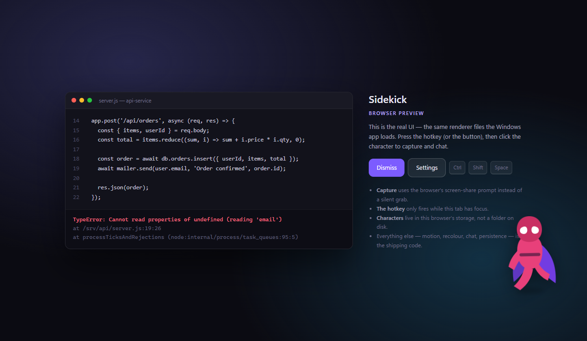
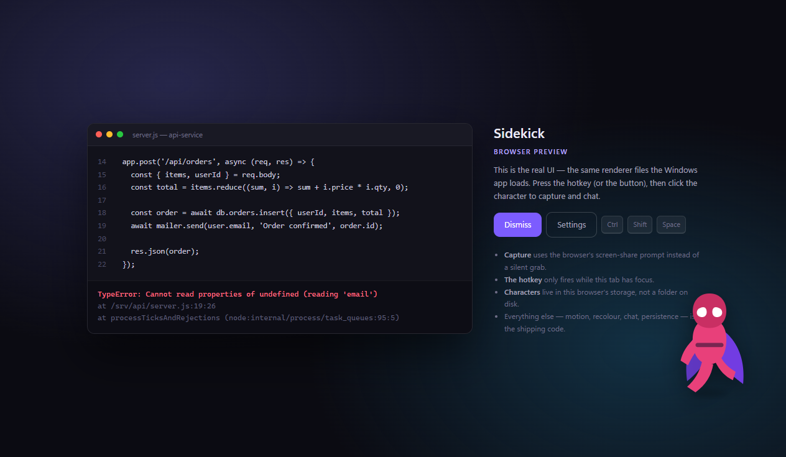
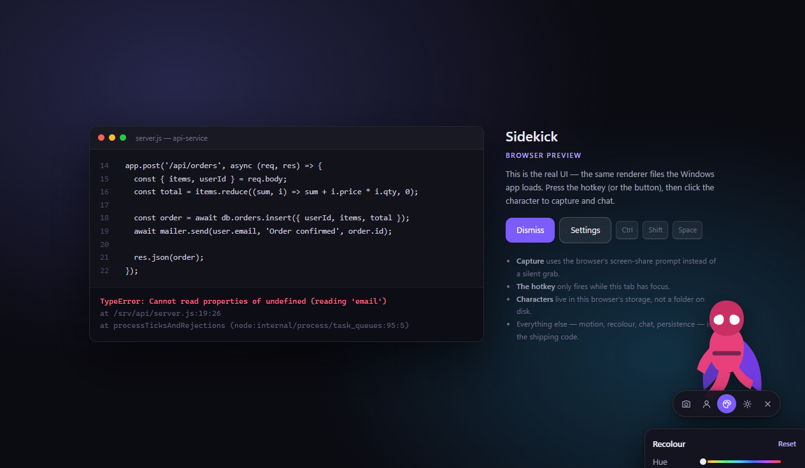
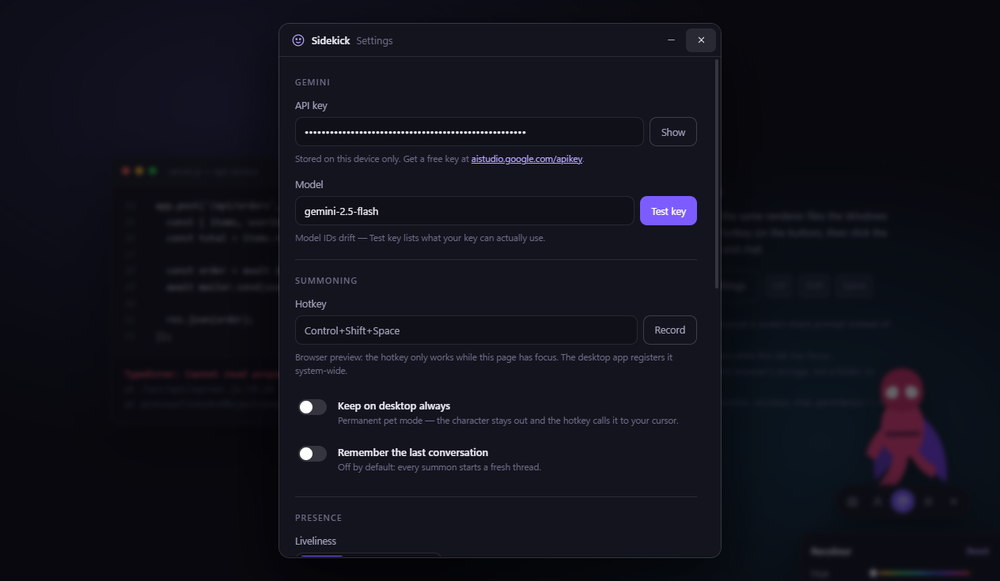
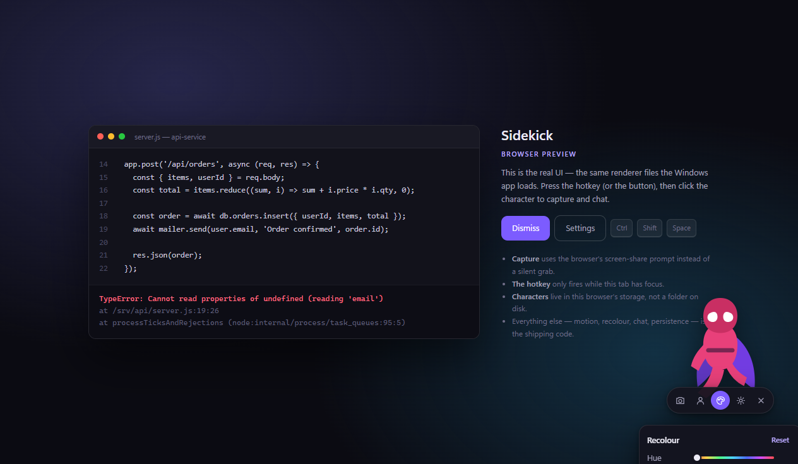

# Sidekick

A summonable desktop AI companion for Windows. Press a hotkey, your character swings onto the
screen, click it — it screenshots what you're looking at and opens a chat about it, powered by
Google Gemini.

Built from `PRD-Sidekick_3.md`.



<table>
  <tr>
    <td width="50%"></td>
    <td width="50%"></td>
  </tr>
  <tr>
    <td><em>Hover pauses all motion and reveals the toolbar — the character is always a reliable click target.</em></td>
    <td><em>Hue/tint recolour works on any image; built-in vectors also get per-part colours.</em></td>
  </tr>
  <tr>
    <td></td>
    <td></td>
  </tr>
  <tr>
    <td><em>Settings: API key with a live "Test key", hotkey recorder, liveliness, toggles.</em></td>
    <td><em>Drop in any image to add a character; your own can be deleted, built-ins can't.</em></td>
  </tr>
</table>

> Screenshots are from the browser preview (`npm run web`), which runs the exact same renderer
> code the desktop app does.

---

## Run it

```bash
npm install

npm start     # the real thing — Electron desktop app
npm run web   # browser preview at http://localhost:5173
```

> **If `npm start` dies with `Cannot read properties of undefined (reading 'requestSingleInstanceLock')`:**
> your shell has `ELECTRON_RUN_AS_NODE=1` set (VS Code's integrated terminal does this). That makes
> Electron boot as plain Node, so `require('electron')` hands back a path string instead of the API.
> Clear it first — PowerShell: `Remove-Item Env:ELECTRON_RUN_AS_NODE`, bash: `unset ELECTRON_RUN_AS_NODE`
> — or just run from a normal terminal outside the IDE.

### First run

There is no API key baked in. On first launch the Settings window opens by itself — paste a free
Gemini key from [aistudio.google.com/apikey](https://aistudio.google.com/apikey) and hit **Test
key**, which validates it and fills the model list with whatever your key can actually use.
The key is written to `%APPDATA%/Sidekick/settings.json` and never leaves the machine.

### Using it

| Action | How |
|---|---|
| Summon / dismiss | `Ctrl+Shift+Space` (configurable), or `Esc` to dismiss |
| Capture + chat | Click the character |
| Move it | Drag it anywhere; it remembers where you left it, per character |
| Character / colour / settings | Hover the character → toolbar underneath it |
| Fresh screenshot mid-thread | **Re-capture** in the chat header |

---

## The browser preview

`npm run web` serves the **same renderer files** the desktop app loads — `src/renderer/**` and
`assets/**` — over a zero-dependency static server. Only the backing bridge differs:

| | Electron | Browser preview |
|---|---|---|
| Bridge | `src/preload/bridge.js` → IPC → main process | `src/renderer/shared/bridge-web.js` |
| Capture | `desktopCapturer`, silent, full-res primary display | `getDisplayMedia` — the browser asks you to pick a screen |
| Hotkey | `globalShortcut`, works from any app | only while the tab has focus |
| Click-through | `setIgnoreMouseEvents` on a transparent always-on-top window | iframe `pointer-events` toggled by forwarded hit-tests |
| Characters | a folder you drop files into | a file picker, stored in `localStorage` |
| Storage | `settings.json` in userData | `localStorage` |

Motion, recolour, the character system, the chat and persistence are the shipping code in both.

---

## Layout

```
src/
  main/         Electron main process
    main.js       lifecycle, global hotkey, summon/dismiss, IPC
    windows.js    the three windows + overlay-hiding for capture
    store.js      debounced JSON persistence in userData
    capture.js    full-res primary-display grab
    gemini.js     Gemini calls + human-readable error translation
    characters.js built-in + user character catalogue, folder watcher
  preload/      contextBridge → window.sidekickBridge
  renderer/
    companion/    the overlay: entrance, rest, idle bob, drag, recolour, picker
    chat/         conversation panel, screenshot strip, small markdown renderer
    settings/     everything in F7
    shared/       design tokens + the browser bridge
assets/characters/  pip.svg, zephyr.svg (built-in vector characters)
web/            browser preview host page + static server
```

### Why one bridge

Every renderer talks only to `window.sidekickBridge` (`invoke` / `send` / `on`). The Electron
preload and the web bridge implement the same shape, which is what lets one copy of the UI run
in both places — and what makes the localhost preview a real review of the shipping code rather
than a mock-up.

---

## PRD decisions as built

- **D1** — chat is an ongoing conversation; history and screenshots stay in the thread, re-capture
  attaches a new image to the same thread.
- **D2** — hue / saturation / brightness recolour for every character including photos; per-part
  colour pickers additionally for the built-in SVGs, driven by their `data-part` attributes.
  Colour is saved per character.
- **D3** — default is summon-then-rest. *Keep on desktop always* in Settings switches to pet mode.
- **D4** — hovering pauses all motion so the character is always a stationary target.
- **D5** — user images swing and glide via position + rotation; they don't walk.
- **D8** — fresh conversation each summon, with *Remember the last conversation* as an opt-in.
- **D9** — liveliness defaults to Calm. Playful drifts to a new spot every 90–210s; Off is static.

Auto-quiet kicks in after 30s of no interaction. `prefers-reduced-motion` and the in-app toggle
both collapse the entrance and idle motion.

---

## Adding your own character

Three ways, all equivalent — they end up in the same watched folder:

- Settings → **Add character image…** (native file picker on desktop, file input in the browser)
- **Drag an image anywhere onto the Settings window**
- Settings → **Open characters folder** and drop files in by hand (desktop only)

Any PNG / JPG / GIF / WEBP / SVG works. Transparent PNG looks best; the file name becomes the
character name. The picker refreshes on its own — the folder is watched. Hover one of your own
characters to get a **×** to delete it; built-ins can't be removed.

---

## Packaging

```bash
npm run dist    # NSIS installer into dist/
```

---

## Known limits (matching the PRD's v1 scope)

- Primary display only; region-select capture is not in v1.
- Answers arrive whole, not streamed.
- Conversation history isn't browsable — only the current thread, optionally carried over.
- Gemini free tier is roughly 5–15 requests/minute; rate limits surface as a specific error.
- Screenshots can contain secrets. They stay on-device apart from the single AI call, and the
  capture is always visible (character animates, thumbnail shown) so it's never silent.
